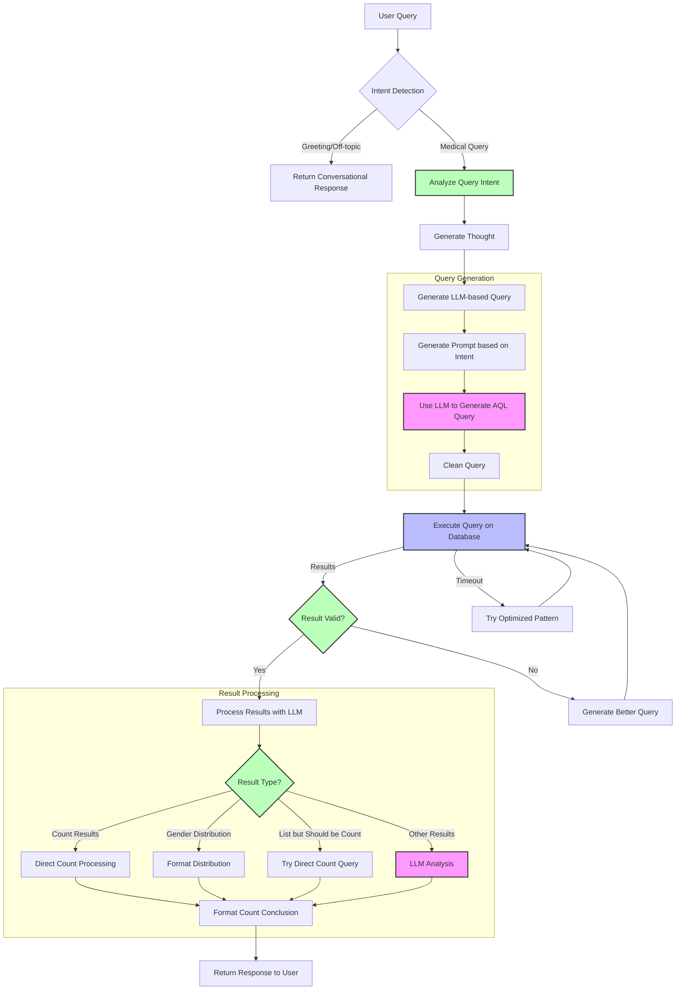

# MedGraph Navigator 🏥

<div align="center">


  <br>
  <strong>Patient Journey & Risk Analytics Platform powered by GraphRAG</strong>
</div>

A comprehensive healthcare analytics platform built for the [ArangoDB Hackathon: Building the Next-Gen Agentic App with GraphRAG & NVIDIA cuGraph](https://arangodbhackathon.devpost.com/).

[](https://medgraph-navigator.onrender.com)

## 🚀 Live Demo

Experience MedGraph Navigator live: [https://medgraph-navigator.onrender.com](https://medgraph-navigator.onrender.com)

## 🔍 Overview

MedGraph Navigator is a next-generation healthcare analytics platform that harnesses the power of graph databases and large language models (LLMs) to provide medical professionals with deep, actionable insights into patient data. Built on ArangoDB’s advanced graph capabilities and enhanced with GraphRAG (Graph-based Retrieval Augmented Generation) technology, MedGraph Navigator revolutionizes healthcare analytics by enabling:

- Natural language querying of complex medical data
- Visual exploration of patient journeys through medical systems
- Risk factor identification and analysis
- Discovery of treatment patterns and outcomes
- Comprehensive healthcare analytics dashboards

## ✨ Key Features

- **Natural Language Query Interface** - Query the medical database using everyday language
- **Patient Explorer** - Visualize and analyze individual patient journeys
- **Analytics Dashboard** - Comprehensive visualizations of healthcare metrics
- **Intent Detection** - AI-powered understanding of query intent
- **GraphRAG Implementation** - Combines graph traversal with LLM reasoning

## 🛠️ Technology Stack

- **Frontend**: Next.js 15, React 19, TailwindCSS, Recharts
- **Backend**: Next.js API Routes
- **Database**: ArangoDB Graph Database
- **AI/ML**: LangChain, Together AI (Llama 3.2)
- **Deployment**: Render.com

## 🏗️ System Architecture

MedGraph Navigator follows a modern, layered architecture:


## 🔍 Query Processing Workflow



Here's how the query processing workflow functions in our agentic medical database application:

1. **Initial Query Processing**

   - The system starts with a user's natural language query
   - First, it runs intent detection to determine if it's a medical query, greeting, or off-topic
   - For non-medical queries, it returns a conversational response without querying the database

2. **Query Intent Analysis**

   - For medical queries, the system analyzes the query intent
   - It extracts query type (count, data, analysis), keywords, filters, and complexity
   - Based on this intent, it generates an appropriate thought about the query strategy

3. **Query Generation with LLM**

   - The system creates a targeted prompt based on query intent
   - The LLM (Llama 3.2 model) generates an AQL query based on this prompt
   - The generated query is cleaned and prepared for execution

4. **Query Execution and Refinement**

   - The query is executed against the ArangoDB database
   - If it times out, the system tries an optimized pattern
   - If results are invalid or don't match expectations, it generates a better query
   - This refinement process continues until valid results are obtained

5. **Result Processing**

   - The system analyzes the result type and formats it appropriately:
     - For count results, it directly processes and formats them
     - For gender distributions, it calculates percentages and formats the data
     - For lists that should be counts, it tries a direct count query
     - For other results, it uses the LLM to analyze them

6. **Response Generation**
   - Finally, it generates a natural language conclusion
   - The complete response (including query, results, conclusion, etc.) is returned to the user

This workflow demonstrates how the application dynamically adapts to different query types and handles special cases like count queries, ensuring users receive appropriate responses regardless of how the LLM initially formulates the database query.

## 🔧 Installation & Setup

### Prerequisites

- Node.js 18+ and npm
- ArangoDB 3.10+
- Together AI API key

### Local Development

1. Clone the repository:

   ```bash
   git clone https://github.com/ajitonelsonn/medgraph-navigator.git
   cd medgraph-navigator
   ```

2. Install dependencies:

   ```bash
   npm install
   ```

3. Set up environment variables:

   ```bash
   cp .env.example .env.local
   ```

   Edit `.env.local` and add your ArangoDB and Together AI credentials.

4. Prepare your ArangoDB database:

   - Follow the setup instructions in the [H_ArngoDB repository](https://github.com/ajitonelsonn/H_ArngoDB) to load the Synthea medical dataset

5. Run the development server:

   ```bash
   npm run dev
   ```

6. Open [http://localhost:3000](http://localhost:3000) in your browser

### Production Deployment

For production deployment to Render.com:

1. Fork this repository
2. Create a new Web Service on Render
3. Link your GitHub repository
4. Configure environment variables
5. Deploy!

## 📊 Usage Examples

### Querying the Medical Database

MedGraph Navigator allows natural language queries against the medical database:

- "How many patients have the race 'white'?"
- "List 10 patients with their birthdates and genders"
- "What is the most common race among patients?"
- "Show me patients born in 2016"

### Analytics Dashboards

The Analytics section provides comprehensive healthcare insights:

- Demographics analysis
- Condition prevalence and trends
- Medication usage patterns
- Treatment outcomes

## 📁 Project Structure

```
medgraph-navigator/
├── app/                  # Next.js app directory
│   ├── analytics/        # Analytics dashboard
│   ├── api/              # API routes
│   ├── components/       # Shared components
│   ├── patients/         # Patient explorer
│   ├── query/            # Query interface
│   └── utils/            # Utility functions
├── public/               # Static assets
├── styles/               # Global styles
├── next.config.js        # Next.js configuration
└── package.json          # Project dependencies
```

## 📄 License

This project is licensed under the MIT License - see the [LICENSE](LICENSE) file for details.

## 👏 Acknowledgments

- [ArangoDB](https://www.arangodb.com/) for the powerful graph database
- [NVIDIA Rapids cuGraph](https://github.com/rapidsai/cugraph) for GPU-accelerated graph analytics
- [Synthea](https://synthea.mitre.org/) for the synthetic healthcare dataset
- [Together AI](https://together.ai/) for the LLM infrastructure
- [ArangoDB Hackathon](https://arangodbhackathon.devpost.com/) for the inspiration

## 📬 Contact

For questions or feedback, please reach out via GitHub Issues or contact:

- GitHub: [@ajitonelsonn](https://github.com/ajitonelsonn)

---

Made with ❤️ in Timor-Leste 🇹🇱
