# MedGraph Navigator 🏥

<div align="center">


  <br>
  <strong>Patient Journey & Risk Analytics Platform powered by GraphRAG</strong>
</div>

A comprehensive healthcare analytics platform built for the [ArangoDB Hackathon: Building the Next-Gen Agentic App with GraphRAG & NVIDIA cuGraph](https://arangodbhackathon.devpost.com/).

[](https://medgraph-navigator.onrender.com)

## 🚀 Live Demo

Experience MedGraph Navigator live: [https://medgraph-navigator.onrender.com](https://medgraph-navigator.onrender.com)

## 🔍 Overview

MedGraph Navigator is a next-generation healthcare analytics platform that harnesses the power of graph databases and large language models (LLMs) to provide medical professionals with deep, actionable insights into patient data. Built on ArangoDB’s advanced graph capabilities and enhanced with GraphRAG (Graph-based Retrieval Augmented Generation) technology, MedGraph Navigator revolutionizes healthcare analytics by enabling:

- Natural language querying of complex medical data
- Visual exploration of patient journeys through medical systems
- Risk factor identification and analysis
- Discovery of treatment patterns and outcomes
- Comprehensive healthcare analytics dashboards

## ✨ Key Features

- **Natural Language Query Interface** - Query the medical database using everyday language
- **Patient Explorer** - Visualize and analyze individual patient journeys
- **Analytics Dashboard** - Comprehensive visualizations of healthcare metrics
- **Intent Detection** - AI-powered understanding of query intent
- **GraphRAG Implementation** - Combines graph traversal with LLM reasoning

## 🛠️ Technology Stack

- **Frontend**: Next.js 15, React 19, TailwindCSS, Recharts
- **Backend**: Next.js API Routes
- **Database**: ArangoDB Graph Database
- **AI/ML**: LangChain, Together AI (Llama 3.2)
- **Deployment**: Render.com

## 🏗️ System Architecture

MedGraph Navigator follows a modern, layered architecture:

```mermaid
graph TB
    User([👤 User]) --> NextApp[["⚛️ Next.js App"]]

    subgraph "Frontend Layer"
        NextApp --> Pages["📄 Pages"]
        NextApp --> Components["🧩 UI Components"]
    end

    subgraph "API Layer"
        NextApp --> APIRoutes["🔌 API Routes"]
        APIRoutes --> QueryAPI["🔍 Query API"]
        APIRoutes --> PatientAPI["👨‍⚕️ Patient API"]
        APIRoutes --> AnalyticsAPI["📊 Analytics API"]
    end

    subgraph "Integration Layer"
        QueryAPI --> LangChain["🦜️ LangChain"]
        LangChain --> TogetherAI["🤖 Together AI"]
        APIRoutes --> ArangoClient["📦 ArangoDB Client"]
    end

    subgraph "Data Layer"
        ArangoClient --> ArangoDB[("🗄️ ArangoDB")]
        ArangoDB --> MedicalData["💊 Medical Graph Data"]
    end

    classDef frontend fill:#d6e4ff,stroke:#9cb2eb,stroke-width:1px;
    classDef api fill:#ffe6cc,stroke:#d79b00,stroke-width:1px;
    classDef integration fill:#d5e8d4,stroke:#82b366,stroke-width:1px;
    classDef database fill:#e1d5e7,stroke:#9673a6,stroke-width:1px;

    class Pages,Components,NextApp frontend;
    class APIRoutes,QueryAPI,PatientAPI,AnalyticsAPI api;
    class LangChain,TogetherAI,ArangoClient integration;
    class ArangoDB,MedicalData database;
```



## 🔍 MedGraph Query Processing Workflow


## MedGraph Query Processing Workflow Explanation

This flowchart illustrates the sophisticated AI-powered processing system behind the MedGraph Navigator's natural language processing capabilities. Here's a detailed breakdown of how the query is transformed into database results:

### Initial Query Processing

1. **User Query** - The process begins when user submit a natural language question about medical data.

2. **Intent Detection** - The system first determines what type of query users are making:

   - If it's a greeting or off-topic question, it responds conversationally without database access
   - If it's a medical database query, it proceeds to deeper analysis

3. **Query Intent Analysis** - For medical queries, the system analyzes:

   - Query type (count, data retrieval, or analysis)
   - Keywords related to medical conditions
   - Filters like gender, race, birth year
   - Overall query complexity

4. **Thought Generation** - Based on the intent analysis, the system generates a "thought" that outlines its approach to answering user question.

### Query Generation Process

5. **LLM-based Query Generation** - The system translates user natural language into a database query through several steps:

   - **Prompt Creation** - Builds a detailed prompt for the AI with user intent and database schema
   - **LLM Query Generation** - Uses an advanced large language model to write an AQL database query
   - **Query Cleaning** - Cleans and validates the query syntax before execution

6. **Database Execution** - The generated query is run against the medical database.

   - If the query times out, the system attempts an optimized pattern
   - The system evaluates if the returned results are valid

7. **Query Validation** - If the results don't properly answer user question, the system generates an improved query and tries again.

### Result Processing and Analysis

8. **Initial Result Processing** - When valid results are obtained, they undergo processing.

9. **LLM Result Analysis** - The results are analyzed by an AI to determine quality and relevance:

   - **Format Checking** - Verifies the structure matches what was requested (counts, lists, etc.)
   - **Intent Verification** - Confirms the results actually answer user original question
   - **Data Quality Validation** - Identifies any issues with the data itself
   - **Conclusion Generation** - Creates a natural language explanation of the findings

10. **Result Optimization** (if needed):

    - If the results aren't optimal, an improved query is executed
    - New improved results are validated
    - The system decides whether to use the improved results or fall back to the original results with a warning

11. **Response Formatting** - The final results are formatted into an appropriate visualization (tables, charts, counts, etc.)

12. **User Response** - The complete processed results are returned to user with the appropriate visualization.

### Technical Implementation

The system employs different processing types represented by colors in the diagram:

- **Pink (LLM)**: Steps powered by large language models
- **Blue (Database)**: Database query operations
- **Green (Analysis)**: Algorithmic analysis operations
- **Yellow (Process)**: Special processing for improved queries

This sophisticated pipeline ensures that user natural language questions about medical data are accurately translated into database queries, executed efficiently, and the results are thoroughly validated to provide the most accurate and relevant information possible.

## 🔧 Installation & Setup

### Prerequisites

- Node.js 18+ and npm
- ArangoDB 3.10+
- Together AI API key

### Local Development

1. Clone the repository:

   ```bash
   git clone https://github.com/ajitonelsonn/medgraph-navigator.git
   cd medgraph-navigator
   ```

2. Install dependencies:

   ```bash
   npm install
   ```

3. Set up environment variables:

   ```bash
   cp .env.example .env.local
   ```

   Edit `.env.local` and add your ArangoDB and Together AI credentials.

4. Prepare your ArangoDB database:

   - Follow the setup instructions in the [H_ArngoDB repository](https://github.com/ajitonelsonn/H_ArngoDB) to load the Synthea medical dataset

5. Run the development server:

   ```bash
   npm run dev
   ```

6. Open [http://localhost:3000](http://localhost:3000) in your browser

### Production Deployment

For production deployment to Render.com:

1. Fork this repository
2. Create a new Web Service on Render
3. Link your GitHub repository
4. Configure environment variables
5. Deploy!

## 📊 Usage Examples

### Querying the Medical Database

MedGraph Navigator allows natural language queries against the medical database:

- "How many patients have the race 'white'?"
- "List 10 patients with their birthdates and genders"
- "What is the most common race among patients?"
- "Show me patients born in 2016"
- "List patients that get diabetes and born in 1964"

### Analytics Dashboards

The Analytics section provides comprehensive healthcare insights:

- Demographics analysis
- Condition prevalence and trends
- Medication usage patterns
- Treatment outcomes

## 📁 Project Structure

```
medgraph-navigator/
├── app/                  # Next.js app directory
│   ├── analytics/        # Analytics dashboard
│   ├── api/              # API routes
│   ├── components/       # Shared components
│   ├── patients/         # Patient explorer
│   ├── query/            # Query interface
│   └── utils/            # Utility functions
├── public/               # Static assets
├── styles/               # Global styles
├── next.config.js        # Next.js configuration
└── package.json          # Project dependencies
```

## 📄 License

This project is licensed under the MIT License - see the [LICENSE](LICENSE) file for details.

## 👏 Acknowledgments

- [ArangoDB](https://www.arangodb.com/) for the powerful graph database
- [NVIDIA Rapids cuGraph](https://github.com/rapidsai/cugraph) for GPU-accelerated graph analytics
- [Synthea](https://synthea.mitre.org/) for the synthetic healthcare dataset
- [Together AI](https://together.ai/) for the LLM infrastructure
- [ArangoDB Hackathon](https://arangodbhackathon.devpost.com/) for the inspiration

## 📬 Contact

For questions or feedback, please reach out via GitHub Issues or contact:

- GitHub: [@ajitonelsonn](https://github.com/ajitonelsonn)

---

Made with ❤️ in Timor-Leste 🇹🇱
